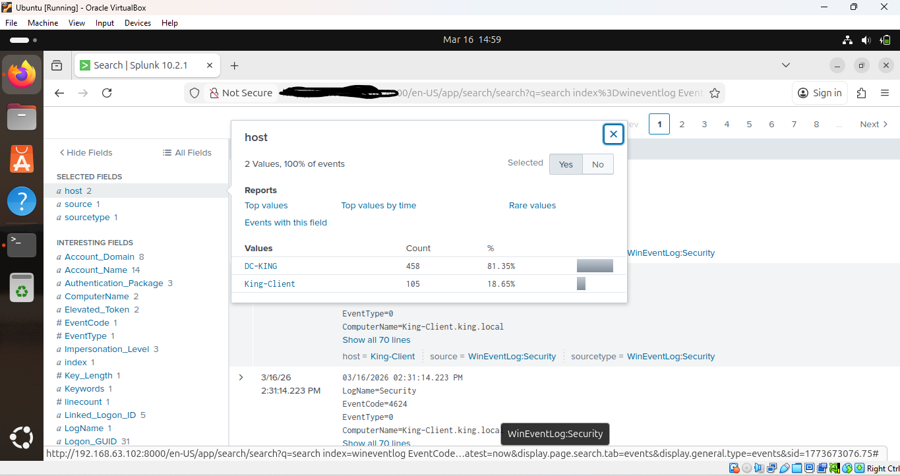
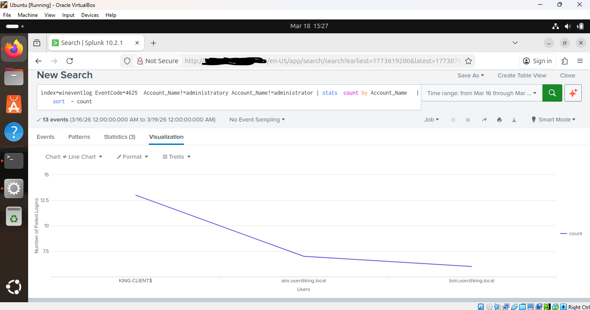
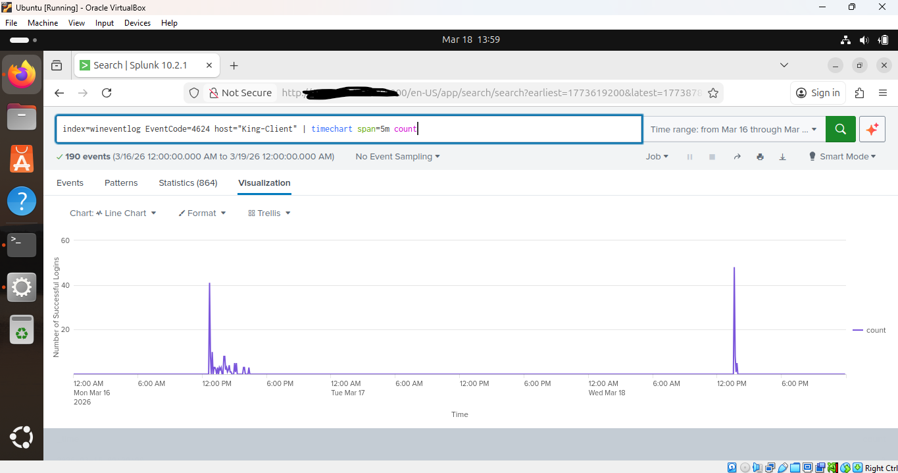
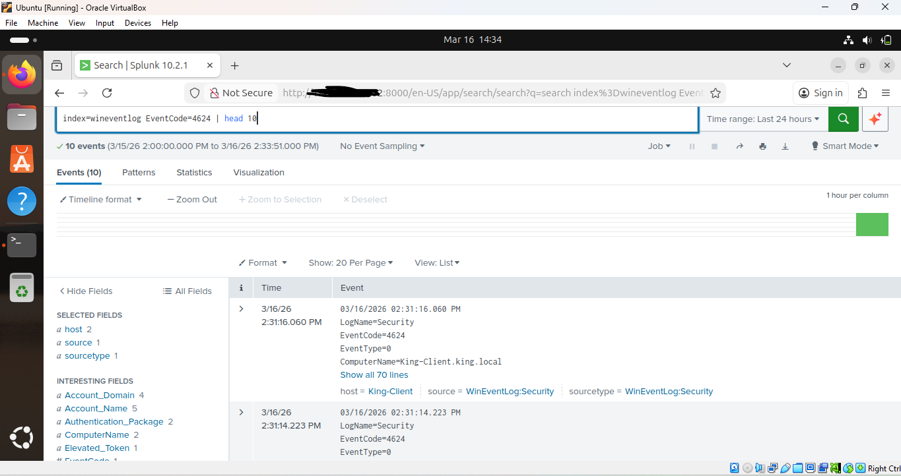
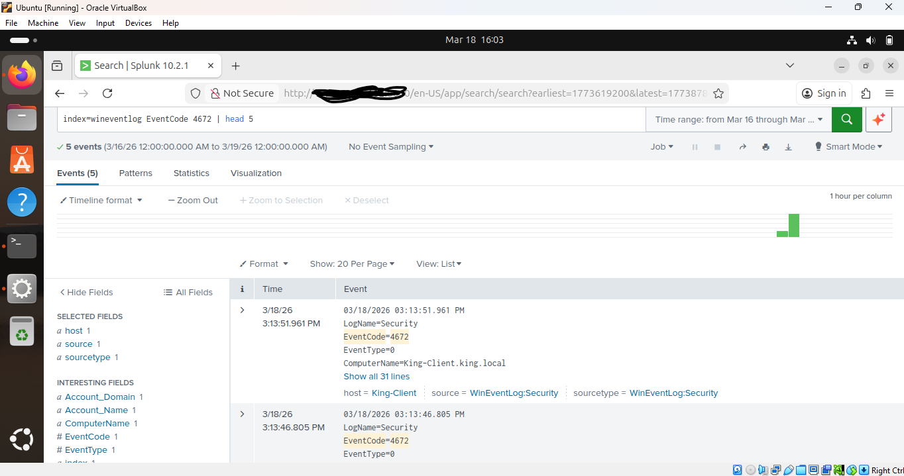
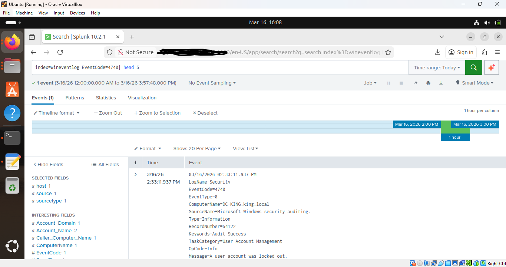

# Active Directory Monitoring With Splunk Enterprise
Centralised SIEM Integration & Authentication Monitoring | Home Lab Project

## Project Overview

Having previously designed and deployed an enterprise-grade Active Directory environment covering domain configuration, OU structure, security groups, user accounts, and audit policiesTh, this project focuses on the next phase: integrating that infrastructure with Splunk Enterprise to enable centralised security monitoring.

Splunk Universal Forwarder was installed and configured on the Domain Controller (DC-KING) and client workstation (KING-CLIENT), forwarding Windows Security event logs to a Splunk server running on Ubuntu. This integration transforms the existing AD environment into a monitored domain infrastructure with real-time visibility into authentication activity across all connected endpoints.

The outcome is a fully operational SIEM pipeline built on infrastructure I designed and deployed end-to-end from domain setup through to centralised log ingestion, detection querying, and SOC-style dashboard monitoring. This reflects the type of identity monitoring architecture used by enterprise security teams to detect threats, investigate incidents, and maintain continuous visibility over domain activity.

## Objectives

- Deploy and configure Splunk Enterprise on Ubuntu as a centralised SIEM platform
- Install and configure Splunk Universal Forwarder on the Domain Controller and client workstation
- Forward Windows Security event logs from both endpoints to the Splunk server
- Validate end-to-end log ingestion and confirm active host connectivity
- Build Splunk queries and dashboard panels to surface authentication threats across the domain

## Lab Architecture

| Component | Detail |
|---|---|
| SIEM Platform | Ubuntu 22.04 running Splunk Enterprise |
| Domain Controller | Windows Server 2022 (DC-KING) |
| Client Workstation | Domain-joined Windows endpoint (KING-CLIENT) |
| Log Forwarding | Splunk Universal Forwarder |
| Virtualisation | Oracle VM VirtualBox |

## Prerequisites

| Requirement | Detail |
|---|---|
| Virtualisation | VirtualBox 7.0 or later |
| DC OS | Windows Server 2022 |
| Client OS | Windows 10 or Windows 11 |
| SIEM OS | Ubuntu 22.04 |
| SIEM Platform | Splunk Enterprise |
| Domain | Configured Active Directory domain (king.local) |
| Network | Isolated VirtualBox internal lab network |

## Tools & Libraries

| Tool | Purpose |
|---|---|
| Splunk Enterprise | SIEM platform for centralised log ingestion, querying and visualisation |
| Splunk Universal Forwarder | Log forwarding agent deployed on DC-KING and KING-CLIENT |
| Ubuntu 22.04 | Operating system hosting the Splunk server |
| Windows Server 2022 | Domain Controller operating system |
| Active Directory Domain Services | Domain identity infrastructure and event source |
| Oracle VM VirtualBox | Virtualisation platform for hosting all VMs |

## Implementation Workflow

**1. Splunk Enterprise Deployment on Ubuntu**
- Installed Splunk Enterprise on Ubuntu 22.04 and enabled the Splunk Web interface
- Configured a receiving port to accept incoming log data from Windows endpoints
- Created a dedicated index for Windows Security event logs to isolate domain telemetry

**2. Splunk Universal Forwarder Configuration**
- Installed Splunk Universal Forwarder on DC-KING and KING-CLIENT
- Configured each forwarder to collect and transmit Windows Security event logs to the Splunk server
- Validated successful connectivity by confirming both hosts appeared as active sources in Splunk

**3. Detection Queries & Dashboard Development**
- Developed Splunk queries targeting key Windows Security Event IDs related to authentication and privilege activity
- Built dashboard panels to visualise logon trends, failure patterns, and account lockout events across the domain

## Event ID Reference

| Event ID | Category | Description | Detection Use Case |
|---|---|---|---|
| 4624 | Authentication | Successful Logon | Baseline logon activity and anomalous access patterns |
| 4625 | Authentication | Failed Logon | Brute-force attempts and password spray detection |
| 4672 | Privilege | Special Privileges Assigned | Privileged account usage and escalation monitoring |
| 4740 | Account | Account Locked Out | Brute-force threshold breach and lockout detection |

## Detection Queries

| Event ID | Query | Purpose |
|---|---|---|
| 4625 | `index=wineventlog EventCode=4625 \| timechart span=5m count` | Visualise failed logon attempts over time to identify brute-force patterns |
| 4624 | `index=wineventlog EventCode=4624 \| timechart span=5m count` | Baseline successful logon activity and detect anomalous spikes |
| 4625 & 4740 | `index=wineventlog EventCode IN (4625,4740) \| head 10` | Correlate failed logons with account lockouts to confirm brute-force threshold breaches |
| 4672 | `index=wineventlog EventCode=4672 \| head 10` | Surface privileged logon activity for escalation and lateral movement detection |

## Key Findings

- Successfully deployed a full SIEM pipeline from Windows domain infrastructure to Splunk Enterprise on Ubuntu
- Both DC-KING and KING-CLIENT confirmed as active log sources in Splunk following Universal Forwarder configuration
- Failed logon events (Event ID 4625) were ingested and visualised as a time-series, enabling pattern-based brute-force detection
- Successful logon events (Event ID 4624) established an authentication baseline against which anomalous activity can be identified
- Account lockout events (Event ID 4740) were captured and correlated with failed logon spikes, confirming end-to-end detection of brute-force threshold breaches
- Privileged logon activity (Event ID 4672) was surfaced via Splunk query, demonstrating visibility into elevated access events across the domain
- Dashboard panels validated the ability to monitor authentication threats in a SOC-style environment

## Analyses

| Analysis | Description |
|---|---|
| 1. DC & Client Connection | Validation of active host connections to the Splunk server |
| 2. Failed Logins | Time-series visualisation of Event ID 4625 failed logon activity |
| 3. Successful Logins | Time-series visualisation of Event ID 4624 successful logon activity |
| 4. Successful Login Detail | Event ID 4624 logon event detail and field inspection |
| 5. Privilege Use | Event ID 4672 privileged logon activity across the domain |
| 6. Account Lockout | Event ID 4740 account lockout detection and correlation |

## Project Structure
```
Active-Directory-Monitoring-With-Splunk-Enterprise/
├── DC & Client Connection.png               # Active host validation in Splunk
├── Line Graph (Failed Logins).png           # Failed logon trend (Event ID 4625)
├── Line Graph (Successful Login).png        # Successful logon trend (Event ID 4624)
├── Successful Login (Event 4624).png        # Successful logon event detail
├── Privilege use (Event 4672).png           # Privileged logon activity (Event ID 4672)
├── Account Lockout (Event 4740).png         # Account lockout event (Event ID 4740)
└── README.md                                # Project documentation
```

## Evidence

### DC & Client Connection
[](dc-client-connection.png)

### Failed Logins — Event ID 4625
[](line-graph-failed-logins.png)

### Successful Logins — Event ID 4624
[](line-graph-successful-login.png)

### Successful Login Detail — Event ID 4624
[](successful-login-event-4624.png)

### Privilege Use — Event ID 4672
[](privilege-use-event-4672.png)

### Account Lockout — Event ID 4740
[](account-lockout-event-4740.png)

## Author

Kingsley Eboh
[GitHub](https://github.com/Kingsley-Eboh)

This project is intended for portfolio and educational purposes. All activity was simulated in an isolated lab environment with no connection to production systems.
